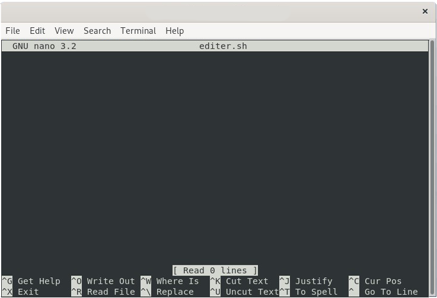
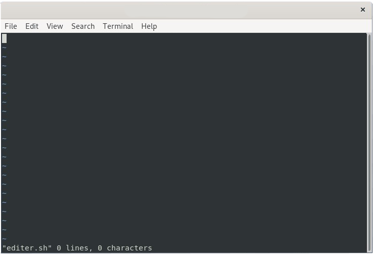

# Editer un fichier

## Editer un fichier avec ``nano``

> La première version de nano a été écrite par Chris Allegretta en 1999, et s’appelait TIP (acronyme récursif de TIP Isn't Pico, « TIP n’est pas Pico »). Son ambition était d’écrire un logiciel libre pour remplacer Pico, car ni Pico ni Pine n’étaient distribués sous une licence libre. [Wikipédia](https://fr.wikipedia.org/wiki/GNU_nano)

On peut éditer un fichier avec la  commande `nano`

Pour ce faire on doit faire comme ceci `nano nomdufichier`

#### Exemple :

On veut éditer un fichier nommé `editer.sh`.

Donc on va dans le répertoire où se trouve le fichier (ou on peut utiliser un chemin absolu tel que `nano Documents/editer.sh`).

On tape la commande :
```bash
$ nano editer.sh
```
Voici ce qui apparait une fois la commande tapée :



C'est tout simplement un éditeur donc on peut écrire ce qu'on (dans le cas d'un fichier ".sh" on veut faire un script).

Comme on peut le voir en bas de la page d'édition, il y a certaines des commandes que l'on peut faire.

**À noter que le symbole "*^*" équivaut à la touche "*Ctrl*"**

Avec la commande ***Ctrl + G***, on peut avoir toutes les commandes qui ne sont pas affiché.

Quelques commandes pratiques :

- ***Ctrl + S*** : pour sauvegarder ce qu'on a fait.

- ***Ctrl + X*** : pour quitter l'édition et retourner dans le terminal.

- ***Ctrl + W*** : pour rechercher dans le fichier.

- ***Ctrl + K*** : couper du texte (pour sélectionner c'est *Shift + flèche* dans la direction que l'on veut sélectionner)

- ***Ctrl + U*** : coller du texte

## Editer un fichier avec `vi`

> vi est un éditeur de texte en mode texte plein écran écrit par Bill Joy en 1976 sur une des premières versions de la distribution Unix BSD.
>Il est présent d'office sur la majorité des systèmes Unix actuels, souvent sous la forme d'un clone du logiciel vi originel. [Linux-France](http://wiki.linux-france.org/wiki/Utilisation_de_vi)

Ici, ça va être un peu plus compliqué, car au premier abord, ce n'est pas très intuitif.

On va pouvoir éditer notre fichier avec la commande `vi`.

La commande marche pareil que celle de `nano`, c'est-à-dire `vi nomdufichier`.

`vi` fonctionne différemment de `nano`. En effet, il y a 2 modes de fonctionnement avec `vi` :
- le mode **console**, pour y rentrer, il faut appuyer sur *ECHAP*
- le mode **insertion**, pour y entrer, il faut appuyer sur *i*

#### Le mode console.

Le **mode console** permet de faire beaucoup de choses. On peut se **déplacer** dans le fichier, faire des **copier-coller**, **supprimer** des mots ou des lettres, etc...

Normalement on est dans ce mode dès **le démarrage**.

Il y a énormément de commande, mais voici les plus pratiques (vous pouvez retrouver la documentation de Linux-France [ici](http://wiki.linux-france.org/wiki/Utilisation_de_vi)) :


##### Exemple :

On veut éditer le fichier `editer.sh` :

```bash
$ vi editer.sh
```
Voici la fenêtre qui s'ouvre :



Je vais donner les principales commandes ainsi que quelques petites choses pour bien se servir de `vi`.

Tout d'abord, voici la manière de comprendre ce que j'écris :
- `:` et **une lettre ou une suite de lettres**, ça veut dit que c'est une ligne de commande donc il faut appuyer sur `:` puis sur la lettre en question et appuyer sur `Enter`.

    Exemple : `:` puis `q` pour quitter `vi`.

- `Ctrl + latouche`, ça signifie qu'il faut appuyer sur les touches en même temps.
- `touche`, c'est qu'il faut juste appuyer sur la touche.

#### En mode *édition*

- On peut **écrire**, mais **ATTENTION**, on ne peut pas se déplacer d'une ligne à une autre. (pour ce faire, il faut être dans le mode console)

- Comme dit précédemment, pour rentrer dans le mode édition il faut appuyer sur ***i***.

- ***a*** : entrer dans le mode édition mais à l'endroit où est mis le curseur.

- ***Retour arrière*** : permet de revenir en arrière sur la ligne. Peut permettre de réécrire par dessus ou de juste supprimer.
- ***x*** ou ***Suppr*** : permet de supprimer le caractère où se trouve le curseur.


#### En mode *console*

##### Les commandes de ***sauvegarde***
- ``:w`` : Sauvegarder le fichier.
- ``:q`` : Quitter `vi` sans sauvegarder (ne fonctionnera pas si on a modifié le fichier).
- ``:q!`` : Quitter `vi` sans sauvegarder mais ne manière forcer.
- ``:wq`` : Quitte et sauvegarde.
- ``:w nom_de_fichier`` : sauvegarde le fichier sous le nom *nom_de_fichier*.
- ``:w! nom_de_fichier`` : remplace le contenu du fichier *nom_de_fichier*.

##### Les commandes ***Copier-Coller***

- ``Y`` : copie la ligne où le curseur est mis.
- ``nY`` : copie `n` ligne. (remplacer n par un chiffre)
-  ``P`` : colle la ligne avant le curseur.
- ``p`` : colle la ligne après le curseur.

##### Les commandes de ***suppression***

- `x` ou `Suppr` : Supprime le caractère du curseur.
- ``dw`` : suppression d'un mot
- ``dnw`` : suppression de ``n`` mots d'une ligne (remplacer n par un chiffre).
- ``dd `` : suppression d'une ligne.
- `ndd` : supprime `n` ligne (remplacer n par un chiffre).

##### Les commandes de ***déplacement du curseur***

- ``les flèches directionnelles`` : Permet de se déplacer dans le fichier. **ATTENTION** : il ne faut pas se déplacer dans le mode édition, mais bien dans le mode console.
- `j` : descend d'une ligne.
- `k` : monte d'une ligne.
- `l` : déplacement vers la droite.
- `h` : déplacement vers la gauche.

Il y a encore plein de commande mais je trouve que ce sont les plus importantes. Voici le lien d'une [vidéo](https://www.youtube.com/watch?v=UIUg2Ktwccw&t) ainsi que d'un [site ](http://wiki.linux-france.org/wiki/Utilisation_de_vi) très pratique qui permettent de mieux comprendre le fonctionnement de `vi`.
