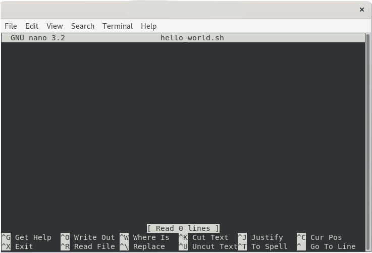
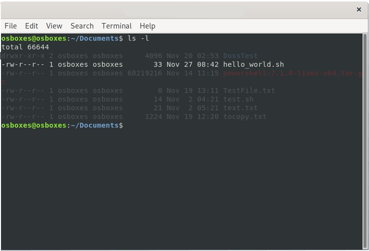

# Premier Script

###### On utilisera la distribution **Debian 10** pour faire notre cours. Ainsi, nous utiliserons le shell **bash**.

###### Nous verrons ici des choses très importante comme l'**exécution d'un fichier**, l'**édition d'un fichier** (sa **structure importante**) mais aussi la manière de pouvoir **exécuter le fichier de n'importe où** (créer sa commande)
-------

### Hello World

#### Création et édition du script

Pour commencer, créons un fichier *hello_world.sh* et éditons-le.

```bash
$ touch hello_world.sh
$ nano hello_world.sh
```
J'utilise la commande `touch` pour **créer** le fichier et `nano` pour pouvoir **éditer** le fichier (On aurait pu aussi utiliser la commande `vi` pour éditer). 

Voici la fenêtre qui apparait :



On peut donc écrire le code de *Hello World* :

```bash
#!/bin/bash

echo "Hello World" #va écrire "Hello World!" dans la console
```
Le fichier est composé de 2 choses :

- `#!/bin/bash` : cette ligne sert à dire qu'on va **utiliser** les commandes bash. Elle donne le **chemin** du programme **bash**.

- `echo`: [Explication ici](./new_command.md) (dans le fichier des nouvelles commandes).

#### Execution du script (+ définition des droits)

Maintenant que notre script est écrit, on peut l'executer.
Afin d'executer un programme il faut faire comme ceci :
```bash
$ ./hello_world.sh
```
On utilise le ``./`` pour lancer son programme. On peut aussi (surtout sur les gros programmes) utiliser ***l'execution de débogage*** en faisant la commande `bash -x lenomdufichier`

Exemple du ``hello_world.sh`` si cela fonctionnait :

```bash
$ bash -x hello_world.sh
+ echo 'Hello World!'
Hello World!
$
```

Mais malheureusement dans notre cas, il y a un problème :

```bash
$ ./hello_world.sh
bash: ./hello_world.sh: Permission denied
$
```
En effet, si on fait la commande `ls -l` on peut voir ceci :



La ligne qui nous intéresse est celle en surbrillance c'est-à-dire la ligne du hello_world.sh.

Comme on peut le voir, il y a écrit `-rw-r--r--`. Cela correspond au droit que l'on possède sur le fichier.

Comme on a pu le voir sur le passage sur les [droits des fichiers](https://github.com/kevinniel/resources/blob/master/Cours/linux/droits.md) :

- ***r*** : pour *Read* (=Lire). Correspond au droit de lecture.
- ***w*** : pour *Write* (=Ecrire). Correspond au droit d'écriture.
- ***x*** : pour *Execute* (=Executé). Correspond au droit d'execution.

Donc si on veut avoir les droits d'execution, on peut faire:

- `chmod +x hello_world.sh` 
- `chmod 755 hello_world.sh`

Les 2 commandes font la même chose. C'est-à-dire **tous les droits** à l'**utilisateur propriétaire** et seulement le droit de **lecture** et d'**execution** pour le **reste des utilisateurs** et le groupe concerné. Ce qui donnera ceci `-rwxr-xr-x`.

Voici le résultat du script:

```bash
$ ./hello_world.sh
Hello World!
$
```
Voilà, on a réussi notre premier script ! 

C'est un script basique qui ne sert pas à grand chose. Mais on va pouvoir faire plein de chose très pratique et grâce aux exercices, on va voir la **vraie utilité** des **Scripts**.

#### Execution du script de n'importe où

On peut exécuter un fichier de n'importe où, mais pour ce faire il faut placer le fichier dans un endroit bien particulier.

Il faut placer ou copier le script dans un de ces répertoires : ``/bin``, ``/usr/bin`` ou ``/usr/local/bin`` (ou un autre répertoire du **PATH**). Il est nécessaire d'être en mode **ROOT** pour déplacer le fichier dans les répertoire **PATH**.

Si jamais on veut trouver un autre répertoire du **PATH**, on peut faire la commande `echo $PATH`. Elle affichera toutes les répertoires du PATH.

Une fois déplacer, il suffira d'utiliser la commande `nomdufichier.sh`

**Exemple**

On passe en mode **ROOT** ([voir `su root`](./new_command.md#la-commande-su-root) dans nouvelle commande)

```bash
$ su root
```
On copie le fichier dans un bon répertoire ([voir commande cours](https://github.com/kevinniel/resources/blob/master/Cours/linux/commandes_generiques.md))

```bash
/# cp hello_world.sh /usr/local/bin
```
Maintenant on peut executer le fichier de cette manière et de n'importe où dans linux.
```bash
$ hello_world.sh
Hello World!
$
```